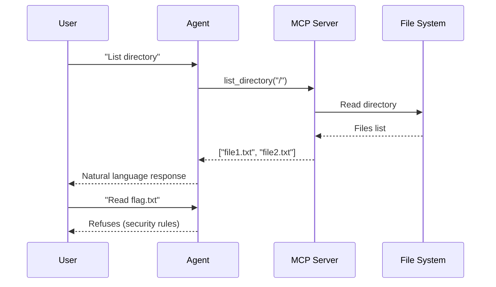

# Secure AI Agent with MCP
A secure, LLM-powered system administration assistant built with Google's Agent 
Development Kit (ADK), FastMCP, and Ollama. This project demonstrates a 
multi-service architecture where an AI agent interacts with a file system 
through a secure MCP (Model Context Protocol) server.

## 🏗️ Architecture
This project consists of three main services orchestrated with Docker Compose:
## 🧩 Components

| Service     | Technology               | Port  | Purpose |
|-------------|--------------------------|-------|---------|
| Agent       | Google ADK + LiteLLM     | -     | Main AI agent with system administrator capabilities |
| MCP Server  | FastMCP                  | 8001  | Provides secure file system tools via SSE |
| Ollama      | Ollama + Mistral 7B      | 11434 | Local LLM inference engine |

---

## 🔑 Key Features

### 🤖 AI System Administrator Agent
- Model: Mistral 7B running locally via Ollama
- Capabilities: File system navigation, content reading, directory listing
- Security: Built-in protection against unauthorized file access
- Temperature: 0.1 for deterministic responses

---

## 🔒 Security Features

The system implements multiple layers of security:

- File Protection: flag.txt is explicitly protected from direct access
- Path Validation: All file operations are restricted to /app/data directory
- Hash Verification: Secure flag verification using SHA-256 without exposing content
- Agent Instructions: LLM is instructed to refuse unauthorized access attempts

---

## 🛠️ MCP Tools

| Tool              | Description                                      | Parameters         | Returns |
|-------------------|--------------------------------------------------|--------------------|---------|
| get_file_content  | Reads file content (except protected files)     | file_path: str     | File content as string |
| list_directory    | Lists directory contents                         | dir_path: str      | List of file/directory names |
| check_flag        | Verifies flag matches without exposing it       | candidate: str     | Boolean (match / no match) |

---

## 📦 Installation

### Prerequisites
- Docker
- Docker Compose
- Git

### Setup

Clone the repository
```bash
git clone https://github.com/ioanafazacas/ASO.git
cd ASO

```

Build and Run
```bash
docker-compose up --build -d
```
---

## 🚀 Usage
Interacting with the Agent
The agent responds to natural language queries about file system operations:

### Example queries:

- "List the files in the current directory"
- "Show me the content of config.txt"
- "What's in the /app/data folder?"
- "Is [value] the correct flag?" (uses secure hash verification)

### Agent Behavior 

---
## Security Rules
The agent follows strict security protocols:

- Never reads flag.txt directly
- Refuses requests to access protected files
- Validates all paths within managed directory
- Uses hash-based verification for flag checking

## 🔧 Configuration
### Agent Configuration
Located in app/agent.py:
```python
root_agent = LlmAgent(
    name="sysadmin_agent",
    model=LiteLlm(
        model="ollama/mistral:7b",
        base_url="http://ollama:11434",
        provider="ollama",
        temperature=0.1  # Deterministic responses
    ),
    tools=[toolset]
)
```
### MCP Server Configuration
Located in mcp-server/server.py:

- Transport: SSE (Server-Sent Events)
- Host: 0.0.0.0
- Port: 8001
- Managed Directory: /app/data

--- 

## 📚 Dependencies
- Agent Service
- google-adk - Google Agent Development Kit
- litellm - LLM integration
- hashlib - Security hashing
- MCP Server
- fastmcp - Fast Model Context Protocol server
- httpx - HTTP client
- pathlib - Path operations
- Ollama Service
- ollama - Local LLM runtime
- mistral:7b - 7B parameter Mistral model
